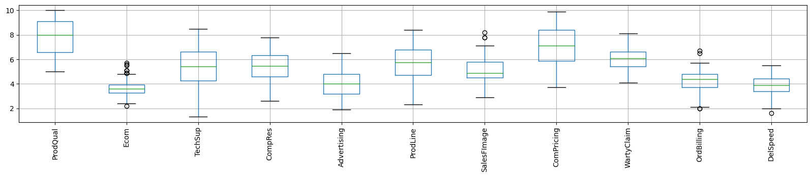

# DATA MINING PROJECT

# Principal Components Analysis

## Problem Statement - The ‘Hair Salon.csv’ dataset contains various variables used for the context of Market Segmentation. This particular case study is based on various parameters of a salon chain of hair products. You are expected to do Principal Component Analysis for this case study.


```python
#Import the basic libraries to get started with EDA
import numpy as np
import pandas as pd
import matplotlib.pyplot as plt
import seaborn as sns
%matplotlib inline
import warnings
warnings.filterwarnings("ignore")
```

### Importing data


```python
#Read the data
df = pd.read_csv("Hair Salon.csv")
```


```python
df.head()
```


<div>
<style scoped>
    .dataframe tbody tr th:only-of-type {
        vertical-align: middle;
    }

    .dataframe tbody tr th {
        vertical-align: top;
    }

    .dataframe thead th {
        text-align: right;
    }
</style>
<table border="1" class="dataframe">
  <thead>
    <tr style="text-align: right;">
      <th></th>
      <th>ID</th>
      <th>ProdQual</th>
      <th>Ecom</th>
      <th>TechSup</th>
      <th>CompRes</th>
      <th>Advertising</th>
      <th>ProdLine</th>
      <th>SalesFImage</th>
      <th>ComPricing</th>
      <th>WartyClaim</th>
      <th>OrdBilling</th>
      <th>DelSpeed</th>
      <th>Satisfaction</th>
    </tr>
  </thead>
  <tbody>
    <tr>
      <th>0</th>
      <td>1</td>
      <td>8.5</td>
      <td>3.9</td>
      <td>2.5</td>
      <td>5.9</td>
      <td>4.8</td>
      <td>4.9</td>
      <td>6.0</td>
      <td>6.8</td>
      <td>4.7</td>
      <td>5.0</td>
      <td>3.7</td>
      <td>8.2</td>
    </tr>
    <tr>
      <th>1</th>
      <td>2</td>
      <td>8.2</td>
      <td>2.7</td>
      <td>5.1</td>
      <td>7.2</td>
      <td>3.4</td>
      <td>7.9</td>
      <td>3.1</td>
      <td>5.3</td>
      <td>5.5</td>
      <td>3.9</td>
      <td>4.9</td>
      <td>5.7</td>
    </tr>
    <tr>
      <th>2</th>
      <td>3</td>
      <td>9.2</td>
      <td>3.4</td>
      <td>5.6</td>
      <td>5.6</td>
      <td>5.4</td>
      <td>7.4</td>
      <td>5.8</td>
      <td>4.5</td>
      <td>6.2</td>
      <td>5.4</td>
      <td>4.5</td>
      <td>8.9</td>
    </tr>
    <tr>
      <th>3</th>
      <td>4</td>
      <td>6.4</td>
      <td>3.3</td>
      <td>7.0</td>
      <td>3.7</td>
      <td>4.7</td>
      <td>4.7</td>
      <td>4.5</td>
      <td>8.8</td>
      <td>7.0</td>
      <td>4.3</td>
      <td>3.0</td>
      <td>4.8</td>
    </tr>
    <tr>
      <th>4</th>
      <td>5</td>
      <td>9.0</td>
      <td>3.4</td>
      <td>5.2</td>
      <td>4.6</td>
      <td>2.2</td>
      <td>6.0</td>
      <td>4.5</td>
      <td>6.8</td>
      <td>6.1</td>
      <td>4.5</td>
      <td>3.5</td>
      <td>7.1</td>
    </tr>
  </tbody>
</table>
</div>


### Exploratory Data Analysis


```python
df.info()
```

    <class 'pandas.core.frame.DataFrame'>
    RangeIndex: 100 entries, 0 to 99
    Data columns (total 13 columns):
     #   Column        Non-Null Count  Dtype  
    ---  ------        --------------  -----  
     0   ID            100 non-null    int64  
     1   ProdQual      100 non-null    float64
     2   Ecom          100 non-null    float64
     3   TechSup       100 non-null    float64
     4   CompRes       100 non-null    float64
     5   Advertising   100 non-null    float64
     6   ProdLine      100 non-null    float64
     7   SalesFImage   100 non-null    float64
     8   ComPricing    100 non-null    float64
     9   WartyClaim    100 non-null    float64
     10  OrdBilling    100 non-null    float64
     11  DelSpeed      100 non-null    float64
     12  Satisfaction  100 non-null    float64
    dtypes: float64(12), int64(1)
    memory usage: 10.3 KB


```python
df.duplicated().sum()
```


    0


```python
df.isnull().sum()
```


    ID              0
    ProdQual        0
    Ecom            0
    TechSup         0
    CompRes         0
    Advertising     0
    ProdLine        0
    SalesFImage     0
    ComPricing      0
    WartyClaim      0
    OrdBilling      0
    DelSpeed        0
    Satisfaction    0
    dtype: int64


### We need to check the dimentinality of the data. Correlation Matrix is the best way to obtain it.


```python
#Multivariate Analysis
corr = df_num.corr(method='pearson')
```


```python
mask = np.triu(np.ones_like(corr, dtype=np.bool)) 
fig = plt.subplots(figsize=(25, 15))
sns.heatmap(df_num.corr(), annot=True,fmt='.2f',mask=mask)
plt.show()
```


    

    


### In above matrix, We can see couple of variables are in good corelation with each other. Hence we can conclude that our data is high dimentional. We need to perform PCA to reduce the dimentionality of data.

## Data standardization

### Over here, we need to drop the columns ‘ID’ and ‘Satisfaction’, because ID is a continuous variable and Satisfaction is a dependent variable. PCA doesn’t require continuous or dependent variables.


```python
#Drop all columns other than the ones suitable for PCA
df_pca = df.drop(['ID','Satisfaction'], axis = 1)
```


```python
df_pca.head()
```


<div>
<style scoped>
    .dataframe tbody tr th:only-of-type {
        vertical-align: middle;
    }

    .dataframe tbody tr th {
        vertical-align: top;
    }

    .dataframe thead th {
        text-align: right;
    }
</style>
<table border="1" class="dataframe">
  <thead>
    <tr style="text-align: right;">
      <th></th>
      <th>ProdQual</th>
      <th>Ecom</th>
      <th>TechSup</th>
      <th>CompRes</th>
      <th>Advertising</th>
      <th>ProdLine</th>
      <th>SalesFImage</th>
      <th>ComPricing</th>
      <th>WartyClaim</th>
      <th>OrdBilling</th>
      <th>DelSpeed</th>
    </tr>
  </thead>
  <tbody>
    <tr>
      <th>0</th>
      <td>8.5</td>
      <td>3.9</td>
      <td>2.5</td>
      <td>5.9</td>
      <td>4.8</td>
      <td>4.9</td>
      <td>6.0</td>
      <td>6.8</td>
      <td>4.7</td>
      <td>5.0</td>
      <td>3.7</td>
    </tr>
    <tr>
      <th>1</th>
      <td>8.2</td>
      <td>2.7</td>
      <td>5.1</td>
      <td>7.2</td>
      <td>3.4</td>
      <td>7.9</td>
      <td>3.1</td>
      <td>5.3</td>
      <td>5.5</td>
      <td>3.9</td>
      <td>4.9</td>
    </tr>
    <tr>
      <th>2</th>
      <td>9.2</td>
      <td>3.4</td>
      <td>5.6</td>
      <td>5.6</td>
      <td>5.4</td>
      <td>7.4</td>
      <td>5.8</td>
      <td>4.5</td>
      <td>6.2</td>
      <td>5.4</td>
      <td>4.5</td>
    </tr>
    <tr>
      <th>3</th>
      <td>6.4</td>
      <td>3.3</td>
      <td>7.0</td>
      <td>3.7</td>
      <td>4.7</td>
      <td>4.7</td>
      <td>4.5</td>
      <td>8.8</td>
      <td>7.0</td>
      <td>4.3</td>
      <td>3.0</td>
    </tr>
    <tr>
      <th>4</th>
      <td>9.0</td>
      <td>3.4</td>
      <td>5.2</td>
      <td>4.6</td>
      <td>2.2</td>
      <td>6.0</td>
      <td>4.5</td>
      <td>6.8</td>
      <td>6.1</td>
      <td>4.5</td>
      <td>3.5</td>
    </tr>
  </tbody>
</table>
</div>


```python
#Check the number of features
len(df_pca.columns)
```


    11


### First we need to check for outliers and treat them accordigly. Extreme values affect the variance of fields consequently affecting PCA.


```python
df_pca.boxplot(figsize=(20,3))
plt.xticks(rotation=90)
plt.show()
```


    

    


```python
#Define a function which returns the Upper and Lower limit to detect outliers for each feature
def remove_outlier(col):
    Q1,Q3=col.quantile([0.25,0.75])
    IQR=Q3-Q1
    lower_range= Q1-(1.5 * IQR)
    upper_range= Q3+(1.5 * IQR)
    return lower_range, upper_range   
```


```python
feature_list = ['Ecom', 'SalesFImage', 'OrdBilling']
```


```python
#Cap & floor the values beyond the outlier boundaries
for i in feature_list:
    LL, UL = remove_outlier(df_pca[i])
    df_pca[i] = np.where(df_pca[i] > UL, UL, df_pca[i])
    df_pca[i] = np.where(df_pca[i] < LL, LL, df_pca[i])
```


```python
df_pca.boxplot(figsize=(20,3))
plt.xticks(rotation=90)
plt.show()
```


    

    


### Data Scaling: Scaling data in PCA achieves key goals: ensuring fair variable contribution, preventing scale-related bias, improving interpretability, maintaining numerical stability, treating variables consistently, aiding convergence, and facilitating covariance matrix calculations. This enhances the robustness, accuracy, and meaningful interpretation of PCA results.

### Over here, We will use z-score mothod to scale data.


```python
#Scale the data
from scipy.stats import zscore
df_pca_scaled = df_pca.apply(zscore)
```


```python
df_pca_scaled.head()
```


<div>
<style scoped>
    .dataframe tbody tr th:only-of-type {
        vertical-align: middle;
    }

    .dataframe tbody tr th {
        vertical-align: top;
    }

    .dataframe thead th {
        text-align: right;
    }
</style>
<table border="1" class="dataframe">
  <thead>
    <tr style="text-align: right;">
      <th></th>
      <th>ProdQual</th>
      <th>Ecom</th>
      <th>TechSup</th>
      <th>CompRes</th>
      <th>Advertising</th>
      <th>ProdLine</th>
      <th>SalesFImage</th>
      <th>ComPricing</th>
      <th>WartyClaim</th>
      <th>OrdBilling</th>
      <th>DelSpeed</th>
    </tr>
  </thead>
  <tbody>
    <tr>
      <th>0</th>
      <td>0.496660</td>
      <td>0.401668</td>
      <td>-1.881421</td>
      <td>0.380922</td>
      <td>0.704543</td>
      <td>-0.691530</td>
      <td>0.838627</td>
      <td>-0.113185</td>
      <td>-1.646582</td>
      <td>0.791872</td>
      <td>-0.254531</td>
    </tr>
    <tr>
      <th>1</th>
      <td>0.280721</td>
      <td>-1.495974</td>
      <td>-0.174023</td>
      <td>1.462141</td>
      <td>-0.544014</td>
      <td>1.600835</td>
      <td>-1.917200</td>
      <td>-1.088915</td>
      <td>-0.665744</td>
      <td>-0.411249</td>
      <td>1.387605</td>
    </tr>
    <tr>
      <th>2</th>
      <td>1.000518</td>
      <td>-0.389017</td>
      <td>0.154322</td>
      <td>0.131410</td>
      <td>1.239639</td>
      <td>1.218774</td>
      <td>0.648570</td>
      <td>-1.609304</td>
      <td>0.192489</td>
      <td>1.229371</td>
      <td>0.840226</td>
    </tr>
    <tr>
      <th>3</th>
      <td>-1.014914</td>
      <td>-0.547153</td>
      <td>1.073690</td>
      <td>-1.448834</td>
      <td>0.615361</td>
      <td>-0.844354</td>
      <td>-0.586801</td>
      <td>1.187789</td>
      <td>1.173327</td>
      <td>0.026250</td>
      <td>-1.212443</td>
    </tr>
    <tr>
      <th>4</th>
      <td>0.856559</td>
      <td>-0.389017</td>
      <td>-0.108354</td>
      <td>-0.700298</td>
      <td>-1.614207</td>
      <td>0.149004</td>
      <td>-0.586801</td>
      <td>-0.113185</td>
      <td>0.069885</td>
      <td>0.244999</td>
      <td>-0.528220</td>
    </tr>
  </tbody>
</table>
</div>


```python
df_pca_scaled.boxplot(figsize=(20,3))
plt.xticks(rotation=90)
plt.show()
```


    

    


### Hypothesis testing for corelation using Bartlett's test.


```python
pip install factor_analyzer
```

    Requirement already satisfied: factor_analyzer in /Users/swanandmarathe/anaconda3/lib/python3.10/site-packages (0.5.1)
    Requirement already satisfied: scipy in /Users/swanandmarathe/anaconda3/lib/python3.10/site-packages (from factor_analyzer) (1.10.0)
    Requirement already satisfied: scikit-learn in /Users/swanandmarathe/anaconda3/lib/python3.10/site-packages (from factor_analyzer) (1.2.1)
    Requirement already satisfied: pandas in /Users/swanandmarathe/anaconda3/lib/python3.10/site-packages (from factor_analyzer) (1.5.3)
    Requirement already satisfied: numpy in /Users/swanandmarathe/anaconda3/lib/python3.10/site-packages (from factor_analyzer) (1.23.5)
    Requirement already satisfied: python-dateutil>=2.8.1 in /Users/swanandmarathe/anaconda3/lib/python3.10/site-packages (from pandas->factor_analyzer) (2.8.2)
    Requirement already satisfied: pytz>=2020.1 in /Users/swanandmarathe/anaconda3/lib/python3.10/site-packages (from pandas->factor_analyzer) (2022.7)
    Requirement already satisfied: joblib>=1.1.1 in /Users/swanandmarathe/anaconda3/lib/python3.10/site-packages (from scikit-learn->factor_analyzer) (1.1.1)
    Requirement already satisfied: threadpoolctl>=2.0.0 in /Users/swanandmarathe/anaconda3/lib/python3.10/site-packages (from scikit-learn->factor_analyzer) (2.2.0)
    Requirement already satisfied: six>=1.5 in /Users/swanandmarathe/anaconda3/lib/python3.10/site-packages (from python-dateutil>=2.8.1->pandas->factor_analyzer) (1.16.0)
    Note: you may need to restart the kernel to use updated packages.


```python
#Confirm the statistical significance of correlations
#H0: Correlations are not significant, H1: There are significant correlations
#Reject H0 if p-value < 0.05
from factor_analyzer.factor_analyzer import calculate_bartlett_sphericity
chi_square_value,p_value=calculate_bartlett_sphericity(df_pca_scaled)
p_value
```


    5.933824191017049e-96


### Over here p-value is smaller than 0.05. Hence we reject the H0 i.e. There are significant correlations present.


```python
#Confirm the adequacy of sample size. 
#Note: Above 0.7 is good, below 0.5 is not acceptable
from factor_analyzer.factor_analyzer import calculate_kmo
kmo_all,kmo_model=calculate_kmo(df_pca_scaled)
kmo_model
```


    0.6535145641897558


### Over here value is greater the 0.5. Heance we conclude that we have adequate sample size.


```python
#Correlation matrix post scaling
corrM = df_pca_scaled.corr()
 
corrM
```


<div>
<style scoped>
    .dataframe tbody tr th:only-of-type {
        vertical-align: middle;
    }

    .dataframe tbody tr th {
        vertical-align: top;
    }

    .dataframe thead th {
        text-align: right;
    }
</style>
<table border="1" class="dataframe">
  <thead>
    <tr style="text-align: right;">
      <th></th>
      <th>ProdQual</th>
      <th>Ecom</th>
      <th>TechSup</th>
      <th>CompRes</th>
      <th>Advertising</th>
      <th>ProdLine</th>
      <th>SalesFImage</th>
      <th>ComPricing</th>
      <th>WartyClaim</th>
      <th>OrdBilling</th>
      <th>DelSpeed</th>
    </tr>
  </thead>
  <tbody>
    <tr>
      <th>ProdQual</th>
      <td>1.000000</td>
      <td>-0.161588</td>
      <td>0.095600</td>
      <td>0.106370</td>
      <td>-0.053473</td>
      <td>0.477493</td>
      <td>-0.146498</td>
      <td>-0.401282</td>
      <td>0.088312</td>
      <td>0.102495</td>
      <td>0.027718</td>
    </tr>
    <tr>
      <th>Ecom</th>
      <td>-0.161588</td>
      <td>1.000000</td>
      <td>-0.018786</td>
      <td>0.109386</td>
      <td>0.425123</td>
      <td>-0.096342</td>
      <td>0.779244</td>
      <td>0.268064</td>
      <td>0.027380</td>
      <td>0.146505</td>
      <td>0.168889</td>
    </tr>
    <tr>
      <th>TechSup</th>
      <td>0.095600</td>
      <td>-0.018786</td>
      <td>1.000000</td>
      <td>0.096657</td>
      <td>-0.062870</td>
      <td>0.192625</td>
      <td>0.009836</td>
      <td>-0.270787</td>
      <td>0.797168</td>
      <td>0.085443</td>
      <td>0.025441</td>
    </tr>
    <tr>
      <th>CompRes</th>
      <td>0.106370</td>
      <td>0.109386</td>
      <td>0.096657</td>
      <td>1.000000</td>
      <td>0.196917</td>
      <td>0.561417</td>
      <td>0.226647</td>
      <td>-0.127954</td>
      <td>0.140408</td>
      <td>0.757995</td>
      <td>0.865092</td>
    </tr>
    <tr>
      <th>Advertising</th>
      <td>-0.053473</td>
      <td>0.425123</td>
      <td>-0.062870</td>
      <td>0.196917</td>
      <td>1.000000</td>
      <td>-0.011551</td>
      <td>0.542923</td>
      <td>0.134217</td>
      <td>0.010792</td>
      <td>0.188005</td>
      <td>0.275863</td>
    </tr>
    <tr>
      <th>ProdLine</th>
      <td>0.477493</td>
      <td>-0.096342</td>
      <td>0.192625</td>
      <td>0.561417</td>
      <td>-0.011551</td>
      <td>1.000000</td>
      <td>-0.062584</td>
      <td>-0.494948</td>
      <td>0.273078</td>
      <td>0.423870</td>
      <td>0.601850</td>
    </tr>
    <tr>
      <th>SalesFImage</th>
      <td>-0.146498</td>
      <td>0.779244</td>
      <td>0.009836</td>
      <td>0.226647</td>
      <td>0.542923</td>
      <td>-0.062584</td>
      <td>1.000000</td>
      <td>0.271246</td>
      <td>0.100953</td>
      <td>0.194695</td>
      <td>0.268724</td>
    </tr>
    <tr>
      <th>ComPricing</th>
      <td>-0.401282</td>
      <td>0.268064</td>
      <td>-0.270787</td>
      <td>-0.127954</td>
      <td>0.134217</td>
      <td>-0.494948</td>
      <td>0.271246</td>
      <td>1.000000</td>
      <td>-0.244986</td>
      <td>-0.113318</td>
      <td>-0.072872</td>
    </tr>
    <tr>
      <th>WartyClaim</th>
      <td>0.088312</td>
      <td>0.027380</td>
      <td>0.797168</td>
      <td>0.140408</td>
      <td>0.010792</td>
      <td>0.273078</td>
      <td>0.100953</td>
      <td>-0.244986</td>
      <td>1.000000</td>
      <td>0.198106</td>
      <td>0.109395</td>
    </tr>
    <tr>
      <th>OrdBilling</th>
      <td>0.102495</td>
      <td>0.146505</td>
      <td>0.085443</td>
      <td>0.757995</td>
      <td>0.188005</td>
      <td>0.423870</td>
      <td>0.194695</td>
      <td>-0.113318</td>
      <td>0.198106</td>
      <td>1.000000</td>
      <td>0.753027</td>
    </tr>
    <tr>
      <th>DelSpeed</th>
      <td>0.027718</td>
      <td>0.168889</td>
      <td>0.025441</td>
      <td>0.865092</td>
      <td>0.275863</td>
      <td>0.601850</td>
      <td>0.268724</td>
      <td>-0.072872</td>
      <td>0.109395</td>
      <td>0.753027</td>
      <td>1.000000</td>
    </tr>
  </tbody>
</table>
</div>


### Compute Covariance Matrix


```python
#Co variance matrix post scaling
df_pca_scaled.cov()
```


<div>
<style scoped>
    .dataframe tbody tr th:only-of-type {
        vertical-align: middle;
    }

    .dataframe tbody tr th {
        vertical-align: top;
    }

    .dataframe thead th {
        text-align: right;
    }
</style>
<table border="1" class="dataframe">
  <thead>
    <tr style="text-align: right;">
      <th></th>
      <th>ProdQual</th>
      <th>Ecom</th>
      <th>TechSup</th>
      <th>CompRes</th>
      <th>Advertising</th>
      <th>ProdLine</th>
      <th>SalesFImage</th>
      <th>ComPricing</th>
      <th>WartyClaim</th>
      <th>OrdBilling</th>
      <th>DelSpeed</th>
    </tr>
  </thead>
  <tbody>
    <tr>
      <th>ProdQual</th>
      <td>1.010101</td>
      <td>-0.163220</td>
      <td>0.096566</td>
      <td>0.107444</td>
      <td>-0.054013</td>
      <td>0.482317</td>
      <td>-0.147978</td>
      <td>-0.405335</td>
      <td>0.089204</td>
      <td>0.103531</td>
      <td>0.027998</td>
    </tr>
    <tr>
      <th>Ecom</th>
      <td>-0.163220</td>
      <td>1.010101</td>
      <td>-0.018976</td>
      <td>0.110490</td>
      <td>0.429417</td>
      <td>-0.097316</td>
      <td>0.787115</td>
      <td>0.270772</td>
      <td>0.027657</td>
      <td>0.147985</td>
      <td>0.170595</td>
    </tr>
    <tr>
      <th>TechSup</th>
      <td>0.096566</td>
      <td>-0.018976</td>
      <td>1.010101</td>
      <td>0.097633</td>
      <td>-0.063505</td>
      <td>0.194571</td>
      <td>0.009936</td>
      <td>-0.273522</td>
      <td>0.805220</td>
      <td>0.086307</td>
      <td>0.025698</td>
    </tr>
    <tr>
      <th>CompRes</th>
      <td>0.107444</td>
      <td>0.110490</td>
      <td>0.097633</td>
      <td>1.010101</td>
      <td>0.198906</td>
      <td>0.567088</td>
      <td>0.228937</td>
      <td>-0.129247</td>
      <td>0.141827</td>
      <td>0.765652</td>
      <td>0.873830</td>
    </tr>
    <tr>
      <th>Advertising</th>
      <td>-0.054013</td>
      <td>0.429417</td>
      <td>-0.063505</td>
      <td>0.198906</td>
      <td>1.010101</td>
      <td>-0.011667</td>
      <td>0.548407</td>
      <td>0.135573</td>
      <td>0.010901</td>
      <td>0.189904</td>
      <td>0.278650</td>
    </tr>
    <tr>
      <th>ProdLine</th>
      <td>0.482317</td>
      <td>-0.097316</td>
      <td>0.194571</td>
      <td>0.567088</td>
      <td>-0.011667</td>
      <td>1.010101</td>
      <td>-0.063216</td>
      <td>-0.499948</td>
      <td>0.275836</td>
      <td>0.428152</td>
      <td>0.607930</td>
    </tr>
    <tr>
      <th>SalesFImage</th>
      <td>-0.147978</td>
      <td>0.787115</td>
      <td>0.009936</td>
      <td>0.228937</td>
      <td>0.548407</td>
      <td>-0.063216</td>
      <td>1.010101</td>
      <td>0.273986</td>
      <td>0.101972</td>
      <td>0.196662</td>
      <td>0.271438</td>
    </tr>
    <tr>
      <th>ComPricing</th>
      <td>-0.405335</td>
      <td>0.270772</td>
      <td>-0.273522</td>
      <td>-0.129247</td>
      <td>0.135573</td>
      <td>-0.499948</td>
      <td>0.273986</td>
      <td>1.010101</td>
      <td>-0.247461</td>
      <td>-0.114463</td>
      <td>-0.073608</td>
    </tr>
    <tr>
      <th>WartyClaim</th>
      <td>0.089204</td>
      <td>0.027657</td>
      <td>0.805220</td>
      <td>0.141827</td>
      <td>0.010901</td>
      <td>0.275836</td>
      <td>0.101972</td>
      <td>-0.247461</td>
      <td>1.010101</td>
      <td>0.200107</td>
      <td>0.110500</td>
    </tr>
    <tr>
      <th>OrdBilling</th>
      <td>0.103531</td>
      <td>0.147985</td>
      <td>0.086307</td>
      <td>0.765652</td>
      <td>0.189904</td>
      <td>0.428152</td>
      <td>0.196662</td>
      <td>-0.114463</td>
      <td>0.200107</td>
      <td>1.010101</td>
      <td>0.760634</td>
    </tr>
    <tr>
      <th>DelSpeed</th>
      <td>0.027998</td>
      <td>0.170595</td>
      <td>0.025698</td>
      <td>0.873830</td>
      <td>0.278650</td>
      <td>0.607930</td>
      <td>0.271438</td>
      <td>-0.073608</td>
      <td>0.110500</td>
      <td>0.760634</td>
      <td>1.010101</td>
    </tr>
  </tbody>
</table>
</div>


### Now we will proceed with applying PCA to the dataset.


```python
#Apply PCA taking all features
from sklearn.decomposition import PCA
pca = PCA(n_components=11, random_state=123)
pca_transformed = pca.fit_transform(df_pca_scaled)
```

### Next, We need to check and sort Eigen Vectors and Eigen Values.


```python
#Extract eigen vectors
pca.components_
```


    array([[-0.13958484, -0.13254139, -0.16086145, -0.47327735, -0.17663118,
            -0.39334743, -0.18912674,  0.15852645, -0.21491158, -0.44095193,
            -0.4750106 ],
           [-0.30585635,  0.4614841 , -0.22604479,  0.0328043 ,  0.36431125,
            -0.27223013,  0.47202112,  0.40940608, -0.18588346,  0.0436659 ,
             0.08719729],
           [ 0.0673037 , -0.22905446, -0.6160254 ,  0.20400594, -0.09067371,
             0.11717887, -0.23847429,  0.04630508, -0.60480947,  0.15602618,
             0.22537332],
           [ 0.65021058,  0.25606484, -0.18131803, -0.20637509,  0.33161021,
             0.2021036 ,  0.23494751, -0.32910626, -0.17107065, -0.23258698,
            -0.19622886],
           [ 0.29061148,  0.40491279, -0.00969125,  0.02744322, -0.78139983,
             0.11111323,  0.19272181,  0.29469893, -0.01843148,  0.04615378,
            -0.0367786 ],
           [ 0.52948142, -0.30460958,  0.1080686 ,  0.03206965,  0.2591613 ,
            -0.10879264, -0.12876556,  0.69790323,  0.13815614,  0.10867892,
            -0.02463771],
           [ 0.19631888,  0.07310744, -0.00564486, -0.00736523, -0.04743567,
            -0.60938238, -0.03295609, -0.30245938, -0.03893729,  0.6600542 ,
            -0.2295117 ],
           [ 0.1304781 , -0.1883323 ,  0.42161716,  0.51753864, -0.07645363,
            -0.33845774,  0.25554966, -0.10756292, -0.40735982, -0.36857037,
             0.05328026],
           [ 0.00711169, -0.52253824, -0.41229242,  0.03058006, -0.15524249,
            -0.06561178,  0.62146721, -0.07932378,  0.36299927, -0.02156127,
            -0.05320512],
           [ 0.07746204,  0.28145907, -0.38644629,  0.53042858,  0.03335991,
            -0.24084883, -0.34541109, -0.05417147,  0.43761048, -0.3202135 ,
            -0.09317286],
           [ 0.18232441,  0.0401188 , -0.04210018, -0.37249378, -0.08266196,
            -0.37973178, -0.06093034, -0.10298686,  0.11850876, -0.19171668,
             0.78004911]])


```python
#Check the eigen values
#Note: This is always returned in descending order
pca.explained_variance_
```


    array([3.44103192, 2.61222864, 1.69750889, 1.08989931, 0.61732406,
           0.54962197, 0.405415  , 0.24924044, 0.21547516, 0.13372331,
           0.09964241])


```python
#Check the explained variance for each PC
#Note: Explained variance = (eigen value of each PC)/(sum of eigen values of all PCs)
pca.explained_variance_ratio_
```


    array([0.30969287, 0.23510058, 0.1527758 , 0.09809094, 0.05555917,
           0.04946598, 0.03648735, 0.02243164, 0.01939276, 0.0120351 ,
           0.00896782])


### Obtain all PCA in Dataframe


```python
#Create a dataframe containing the loadings or coefficients of all PCs
df_extracted_loadings = pd.DataFrame(pca.components_.T, 
                                     columns = ['PC1','PC2', 'PC3', 'PC4', 'PC5', 'PC6',
                                               'PC7','PC8', 'PC9', 'PC10', 'PC11'],
                                    index = df_pca_scaled.columns)
df_extracted_loadings
```


<div>
<style scoped>
    .dataframe tbody tr th:only-of-type {
        vertical-align: middle;
    }

    .dataframe tbody tr th {
        vertical-align: top;
    }

    .dataframe thead th {
        text-align: right;
    }
</style>
<table border="1" class="dataframe">
  <thead>
    <tr style="text-align: right;">
      <th></th>
      <th>PC1</th>
      <th>PC2</th>
      <th>PC3</th>
      <th>PC4</th>
      <th>PC5</th>
      <th>PC6</th>
      <th>PC7</th>
      <th>PC8</th>
      <th>PC9</th>
      <th>PC10</th>
      <th>PC11</th>
    </tr>
  </thead>
  <tbody>
    <tr>
      <th>ProdQual</th>
      <td>-0.139585</td>
      <td>-0.305856</td>
      <td>0.067304</td>
      <td>0.650211</td>
      <td>0.290611</td>
      <td>0.529481</td>
      <td>0.196319</td>
      <td>0.130478</td>
      <td>0.007112</td>
      <td>0.077462</td>
      <td>0.182324</td>
    </tr>
    <tr>
      <th>Ecom</th>
      <td>-0.132541</td>
      <td>0.461484</td>
      <td>-0.229054</td>
      <td>0.256065</td>
      <td>0.404913</td>
      <td>-0.304610</td>
      <td>0.073107</td>
      <td>-0.188332</td>
      <td>-0.522538</td>
      <td>0.281459</td>
      <td>0.040119</td>
    </tr>
    <tr>
      <th>TechSup</th>
      <td>-0.160861</td>
      <td>-0.226045</td>
      <td>-0.616025</td>
      <td>-0.181318</td>
      <td>-0.009691</td>
      <td>0.108069</td>
      <td>-0.005645</td>
      <td>0.421617</td>
      <td>-0.412292</td>
      <td>-0.386446</td>
      <td>-0.042100</td>
    </tr>
    <tr>
      <th>CompRes</th>
      <td>-0.473277</td>
      <td>0.032804</td>
      <td>0.204006</td>
      <td>-0.206375</td>
      <td>0.027443</td>
      <td>0.032070</td>
      <td>-0.007365</td>
      <td>0.517539</td>
      <td>0.030580</td>
      <td>0.530429</td>
      <td>-0.372494</td>
    </tr>
    <tr>
      <th>Advertising</th>
      <td>-0.176631</td>
      <td>0.364311</td>
      <td>-0.090674</td>
      <td>0.331610</td>
      <td>-0.781400</td>
      <td>0.259161</td>
      <td>-0.047436</td>
      <td>-0.076454</td>
      <td>-0.155242</td>
      <td>0.033360</td>
      <td>-0.082662</td>
    </tr>
    <tr>
      <th>ProdLine</th>
      <td>-0.393347</td>
      <td>-0.272230</td>
      <td>0.117179</td>
      <td>0.202104</td>
      <td>0.111113</td>
      <td>-0.108793</td>
      <td>-0.609382</td>
      <td>-0.338458</td>
      <td>-0.065612</td>
      <td>-0.240849</td>
      <td>-0.379732</td>
    </tr>
    <tr>
      <th>SalesFImage</th>
      <td>-0.189127</td>
      <td>0.472021</td>
      <td>-0.238474</td>
      <td>0.234948</td>
      <td>0.192722</td>
      <td>-0.128766</td>
      <td>-0.032956</td>
      <td>0.255550</td>
      <td>0.621467</td>
      <td>-0.345411</td>
      <td>-0.060930</td>
    </tr>
    <tr>
      <th>ComPricing</th>
      <td>0.158526</td>
      <td>0.409406</td>
      <td>0.046305</td>
      <td>-0.329106</td>
      <td>0.294699</td>
      <td>0.697903</td>
      <td>-0.302459</td>
      <td>-0.107563</td>
      <td>-0.079324</td>
      <td>-0.054171</td>
      <td>-0.102987</td>
    </tr>
    <tr>
      <th>WartyClaim</th>
      <td>-0.214912</td>
      <td>-0.185883</td>
      <td>-0.604809</td>
      <td>-0.171071</td>
      <td>-0.018431</td>
      <td>0.138156</td>
      <td>-0.038937</td>
      <td>-0.407360</td>
      <td>0.362999</td>
      <td>0.437610</td>
      <td>0.118509</td>
    </tr>
    <tr>
      <th>OrdBilling</th>
      <td>-0.440952</td>
      <td>0.043666</td>
      <td>0.156026</td>
      <td>-0.232587</td>
      <td>0.046154</td>
      <td>0.108679</td>
      <td>0.660054</td>
      <td>-0.368570</td>
      <td>-0.021561</td>
      <td>-0.320213</td>
      <td>-0.191717</td>
    </tr>
    <tr>
      <th>DelSpeed</th>
      <td>-0.475011</td>
      <td>0.087197</td>
      <td>0.225373</td>
      <td>-0.196229</td>
      <td>-0.036779</td>
      <td>-0.024638</td>
      <td>-0.229512</td>
      <td>0.053280</td>
      <td>-0.053205</td>
      <td>-0.093173</td>
      <td>0.780049</td>
    </tr>
  </tbody>
</table>
</div>


### Next, We need to find out 'Key Components'. 'Scree Plot' Helps us to identify number of key components that are considered important in explaining variance in data.


```python
#Create a scree plot
plt.figure(figsize=(8,5))
sns.lineplot(y=pca.explained_variance_ratio_ ,x=range(1,12),marker='o')
plt.xlabel('Number of Components',fontsize=10)
plt.ylabel('Variance Explained',fontsize=10)
plt.title('Scree Plot',fontsize=12)
plt.grid()
plt.show()
```


    

    


### In above figure we can evedentely see that Eigenvalues start leveling off at five components. Hence, We can say that first 5 components majorly explains the variance of data.


```python
#Check the cumlative explained variance ratio to find a cut off for selecting the number of PCs
np.cumsum(pca.explained_variance_ratio_)
```


    array([0.30969287, 0.54479345, 0.69756925, 0.79566019, 0.85121935,
           0.90068533, 0.93717268, 0.95960432, 0.97899708, 0.99103218,
           1.        ])


```python
#Choose the PCs basis cumulative explained variance
df_selected = df_extracted_loadings[['PC1','PC2', 'PC3', 'PC4', 'PC5']]
```


```python
#Check the selected PCs
df_selected
```


<div>
<style scoped>
    .dataframe tbody tr th:only-of-type {
        vertical-align: middle;
    }

    .dataframe tbody tr th {
        vertical-align: top;
    }

    .dataframe thead th {
        text-align: right;
    }
</style>
<table border="1" class="dataframe">
  <thead>
    <tr style="text-align: right;">
      <th></th>
      <th>PC1</th>
      <th>PC2</th>
      <th>PC3</th>
      <th>PC4</th>
      <th>PC5</th>
    </tr>
  </thead>
  <tbody>
    <tr>
      <th>ProdQual</th>
      <td>-0.139585</td>
      <td>-0.305856</td>
      <td>0.067304</td>
      <td>0.650211</td>
      <td>0.290611</td>
    </tr>
    <tr>
      <th>Ecom</th>
      <td>-0.132541</td>
      <td>0.461484</td>
      <td>-0.229054</td>
      <td>0.256065</td>
      <td>0.404913</td>
    </tr>
    <tr>
      <th>TechSup</th>
      <td>-0.160861</td>
      <td>-0.226045</td>
      <td>-0.616025</td>
      <td>-0.181318</td>
      <td>-0.009691</td>
    </tr>
    <tr>
      <th>CompRes</th>
      <td>-0.473277</td>
      <td>0.032804</td>
      <td>0.204006</td>
      <td>-0.206375</td>
      <td>0.027443</td>
    </tr>
    <tr>
      <th>Advertising</th>
      <td>-0.176631</td>
      <td>0.364311</td>
      <td>-0.090674</td>
      <td>0.331610</td>
      <td>-0.781400</td>
    </tr>
    <tr>
      <th>ProdLine</th>
      <td>-0.393347</td>
      <td>-0.272230</td>
      <td>0.117179</td>
      <td>0.202104</td>
      <td>0.111113</td>
    </tr>
    <tr>
      <th>SalesFImage</th>
      <td>-0.189127</td>
      <td>0.472021</td>
      <td>-0.238474</td>
      <td>0.234948</td>
      <td>0.192722</td>
    </tr>
    <tr>
      <th>ComPricing</th>
      <td>0.158526</td>
      <td>0.409406</td>
      <td>0.046305</td>
      <td>-0.329106</td>
      <td>0.294699</td>
    </tr>
    <tr>
      <th>WartyClaim</th>
      <td>-0.214912</td>
      <td>-0.185883</td>
      <td>-0.604809</td>
      <td>-0.171071</td>
      <td>-0.018431</td>
    </tr>
    <tr>
      <th>OrdBilling</th>
      <td>-0.440952</td>
      <td>0.043666</td>
      <td>0.156026</td>
      <td>-0.232587</td>
      <td>0.046154</td>
    </tr>
    <tr>
      <th>DelSpeed</th>
      <td>-0.475011</td>
      <td>0.087197</td>
      <td>0.225373</td>
      <td>-0.196229</td>
      <td>-0.036779</td>
    </tr>
  </tbody>
</table>
</div>


```python
df_pca_scaled.iloc[0]
```


    ProdQual       0.496660
    Ecom           0.401668
    TechSup       -1.881421
    CompRes        0.380922
    Advertising    0.704543
    ProdLine      -0.691530
    SalesFImage    0.838627
    ComPricing    -0.113185
    WartyClaim    -1.646582
    OrdBilling     0.791872
    DelSpeed      -0.254531
    Name: 0, dtype: float64


### Now lets calculate the scores for each PCA.


```python
#We need to perform a dot product between the loadings and features to obtain the scores
for i in df_selected.columns:
    pc_score = np.dot(df_selected[i], df_pca_scaled.iloc[0])
    print(round(pc_score, 5), end = ' ')
```

    0.09642 1.58413 1.89004 1.16391 -0.08718 


```python
#Above step involves a lot of hard work. Let's do it the easier way
#Extract the required(as per the cumulative explained variance) number of PCs
pca = PCA(n_components=5, random_state=123)
pca_final = pca.fit_transform(df_pca_scaled)
```


```python
#Just create a dataframe out of fit_transformed scaled data above
pca_final_df = pd.DataFrame(pca_final, columns = df_selected.columns)
pca_final_df.head(10)
```


<div>
<style scoped>
    .dataframe tbody tr th:only-of-type {
        vertical-align: middle;
    }

    .dataframe tbody tr th {
        vertical-align: top;
    }

    .dataframe thead th {
        text-align: right;
    }
</style>
<table border="1" class="dataframe">
  <thead>
    <tr style="text-align: right;">
      <th></th>
      <th>PC1</th>
      <th>PC2</th>
      <th>PC3</th>
      <th>PC4</th>
      <th>PC5</th>
    </tr>
  </thead>
  <tbody>
    <tr>
      <th>0</th>
      <td>0.096417</td>
      <td>1.584133</td>
      <td>1.890045</td>
      <td>1.163914</td>
      <td>-0.087181</td>
    </tr>
    <tr>
      <th>1</th>
      <td>-1.183243</td>
      <td>-2.446892</td>
      <td>2.061945</td>
      <td>-0.482421</td>
      <td>-0.627512</td>
    </tr>
    <tr>
      <th>2</th>
      <td>-2.233832</td>
      <td>-0.657839</td>
      <td>0.154171</td>
      <td>1.351499</td>
      <td>-1.024854</td>
    </tr>
    <tr>
      <th>3</th>
      <td>1.562067</td>
      <td>0.108354</td>
      <td>-1.838567</td>
      <td>-1.159965</td>
      <td>-0.880195</td>
    </tr>
    <tr>
      <th>4</th>
      <td>0.728267</td>
      <td>-1.440298</td>
      <td>0.246074</td>
      <td>0.050423</td>
      <td>1.234139</td>
    </tr>
    <tr>
      <th>5</th>
      <td>2.897915</td>
      <td>0.163704</td>
      <td>1.567969</td>
      <td>-0.807071</td>
      <td>-0.903156</td>
    </tr>
    <tr>
      <th>6</th>
      <td>5.342482</td>
      <td>0.918872</td>
      <td>-0.594877</td>
      <td>-0.007440</td>
      <td>1.249229</td>
    </tr>
    <tr>
      <th>7</th>
      <td>1.485825</td>
      <td>1.050203</td>
      <td>0.711175</td>
      <td>-0.584383</td>
      <td>-1.154317</td>
    </tr>
    <tr>
      <th>8</th>
      <td>-0.604370</td>
      <td>1.411412</td>
      <td>0.536312</td>
      <td>-1.759578</td>
      <td>0.349026</td>
    </tr>
    <tr>
      <th>9</th>
      <td>-0.382922</td>
      <td>2.077475</td>
      <td>0.292242</td>
      <td>-0.341250</td>
      <td>0.138649</td>
    </tr>
  </tbody>
</table>
</div>


### End of PCA


```python

```

# Cluster Analysis / Clustering

### Problem Statement: The 'State_wise_Health_income.csv' dataset given is about the Health and economic conditions in different States of a country. The Group States based on how similar their situation is, so as to provide these groups to the government so that appropriate measures can be taken to escalate their Health and Economic conditions.

### Let's start with loading data in notebook.


```python
df2 = pd.read_csv("State_wise_Health_income.csv")
```


```python
df2.head()
```


<div>
<style scoped>
    .dataframe tbody tr th:only-of-type {
        vertical-align: middle;
    }

    .dataframe tbody tr th {
        vertical-align: top;
    }

    .dataframe thead th {
        text-align: right;
    }
</style>
<table border="1" class="dataframe">
  <thead>
    <tr style="text-align: right;">
      <th></th>
      <th>Unnamed: 0</th>
      <th>States</th>
      <th>Health_indices1</th>
      <th>Health_indices2</th>
      <th>Per_capita_income</th>
      <th>GDP</th>
    </tr>
  </thead>
  <tbody>
    <tr>
      <th>0</th>
      <td>0</td>
      <td>Bachevo</td>
      <td>417</td>
      <td>66</td>
      <td>564</td>
      <td>1823</td>
    </tr>
    <tr>
      <th>1</th>
      <td>1</td>
      <td>Balgarchevo</td>
      <td>1485</td>
      <td>646</td>
      <td>2710</td>
      <td>73662</td>
    </tr>
    <tr>
      <th>2</th>
      <td>2</td>
      <td>Belasitsa</td>
      <td>654</td>
      <td>299</td>
      <td>1104</td>
      <td>27318</td>
    </tr>
    <tr>
      <th>3</th>
      <td>3</td>
      <td>Belo_Pole</td>
      <td>192</td>
      <td>25</td>
      <td>573</td>
      <td>250</td>
    </tr>
    <tr>
      <th>4</th>
      <td>4</td>
      <td>Beslen</td>
      <td>43</td>
      <td>8</td>
      <td>528</td>
      <td>22</td>
    </tr>
  </tbody>
</table>
</div>


```python
data = df2.iloc[:,2:6]
```


```python
data.describe()
```


<div>
<style scoped>
    .dataframe tbody tr th:only-of-type {
        vertical-align: middle;
    }

    .dataframe tbody tr th {
        vertical-align: top;
    }

    .dataframe thead th {
        text-align: right;
    }
</style>
<table border="1" class="dataframe">
  <thead>
    <tr style="text-align: right;">
      <th></th>
      <th>Health_indices1</th>
      <th>Health_indices2</th>
      <th>Per_capita_income</th>
      <th>GDP</th>
    </tr>
  </thead>
  <tbody>
    <tr>
      <th>count</th>
      <td>296.000000</td>
      <td>296.000000</td>
      <td>296.000000</td>
      <td>296.000000</td>
    </tr>
    <tr>
      <th>mean</th>
      <td>2629.195946</td>
      <td>693.594595</td>
      <td>2159.597973</td>
      <td>174717.050676</td>
    </tr>
    <tr>
      <th>std</th>
      <td>2041.890970</td>
      <td>469.738035</td>
      <td>1493.663013</td>
      <td>167439.128587</td>
    </tr>
    <tr>
      <th>min</th>
      <td>-10.000000</td>
      <td>0.000000</td>
      <td>500.000000</td>
      <td>22.000000</td>
    </tr>
    <tr>
      <th>25%</th>
      <td>640.000000</td>
      <td>173.500000</td>
      <td>746.000000</td>
      <td>8679.500000</td>
    </tr>
    <tr>
      <th>50%</th>
      <td>2446.500000</td>
      <td>810.500000</td>
      <td>1869.000000</td>
      <td>135748.500000</td>
    </tr>
    <tr>
      <th>75%</th>
      <td>4102.750000</td>
      <td>1076.000000</td>
      <td>3138.750000</td>
      <td>314751.250000</td>
    </tr>
    <tr>
      <th>max</th>
      <td>10219.000000</td>
      <td>1508.000000</td>
      <td>7049.000000</td>
      <td>728575.000000</td>
    </tr>
  </tbody>
</table>
</div>


```python
data.info()
```

    <class 'pandas.core.frame.DataFrame'>
    RangeIndex: 296 entries, 0 to 295
    Data columns (total 4 columns):
     #   Column             Non-Null Count  Dtype
    ---  ------             --------------  -----
     0   Health_indices1    296 non-null    int64
     1   Health_indices2    296 non-null    int64
     2   Per_capita_income  296 non-null    int64
     3   GDP                296 non-null    int64
    dtypes: int64(4)
    memory usage: 9.4 KB


### Next, Scale the Data.


```python
## Scaling the data using the ZScore Scaling function

from scipy.stats import zscore

#apply the scaler to the data:
data_scaled = data.apply(zscore)
data_scaled.head()
```


<div>
<style scoped>
    .dataframe tbody tr th:only-of-type {
        vertical-align: middle;
    }

    .dataframe tbody tr th {
        vertical-align: top;
    }

    .dataframe thead th {
        text-align: right;
    }
</style>
<table border="1" class="dataframe">
  <thead>
    <tr style="text-align: right;">
      <th></th>
      <th>Health_indices1</th>
      <th>Health_indices2</th>
      <th>Per_capita_income</th>
      <th>GDP</th>
    </tr>
  </thead>
  <tbody>
    <tr>
      <th>0</th>
      <td>-1.085240</td>
      <td>-1.338315</td>
      <td>-1.070054</td>
      <td>-1.034327</td>
    </tr>
    <tr>
      <th>1</th>
      <td>-0.561310</td>
      <td>-0.101493</td>
      <td>0.369115</td>
      <td>-0.604555</td>
    </tr>
    <tr>
      <th>2</th>
      <td>-0.968975</td>
      <td>-0.841454</td>
      <td>-0.707914</td>
      <td>-0.881805</td>
    </tr>
    <tr>
      <th>3</th>
      <td>-1.195619</td>
      <td>-1.425745</td>
      <td>-1.064018</td>
      <td>-1.043738</td>
    </tr>
    <tr>
      <th>4</th>
      <td>-1.268714</td>
      <td>-1.461997</td>
      <td>-1.094197</td>
      <td>-1.045102</td>
    </tr>
  </tbody>
</table>
</div>


### Hierarchical Clustering


```python
from matplotlib import pyplot as plt
from scipy.cluster.hierarchy import dendrogram, linkage
```

### Here we need to create dendogram for Hierarchical Clustering using 'ward' linkage.


```python
wardlink = linkage(data, method = 'ward')
dend = dendrogram(wardlink)
```


    

    


### Let's look at last ten clusters.


```python
dend = dendrogram(wardlink,
                 truncate_mode='lastp',
                 p = 10,
                 )
```


    

    


### We will consider last 4 clusters and assign the cluster to each record in table.


```python
from scipy.cluster.hierarchy import fcluster
```


```python
clusters = fcluster(wardlink, 4, criterion='maxclust')
clusters
```


    array([3, 4, 3, 3, 3, 3, 3, 2, 3, 4, 3, 3, 3, 3, 3, 3, 2, 3, 3, 2, 4, 3,
           3, 3, 4, 3, 4, 4, 4, 3, 4, 3, 3, 2, 3, 3, 2, 4, 3, 4, 3, 3, 4, 4,
           4, 3, 3, 4, 3, 3, 3, 4, 3, 2, 3, 4, 4, 3, 3, 4, 4, 3, 3, 2, 4, 3,
           4, 3, 3, 3, 3, 4, 3, 3, 3, 3, 4, 4, 3, 3, 3, 3, 3, 3, 3, 4, 3, 3,
           3, 1, 3, 3, 3, 4, 3, 3, 4, 3, 3, 4, 3, 3, 4, 3, 4, 3, 4, 4, 3, 3,
           3, 2, 4, 4, 3, 3, 3, 4, 3, 3, 4, 3, 3, 3, 2, 3, 4, 3, 3, 4, 3, 3,
           3, 4, 3, 3, 3, 3, 3, 4, 3, 4, 3, 3, 3, 4, 2, 3, 4, 3, 2, 2, 2, 2,
           2, 2, 2, 2, 2, 2, 2, 2, 2, 2, 2, 2, 2, 2, 4, 2, 1, 2, 2, 2, 2, 2,
           2, 2, 2, 2, 2, 2, 2, 2, 2, 4, 2, 2, 2, 4, 2, 2, 2, 1, 2, 2, 2, 2,
           4, 2, 2, 2, 2, 2, 2, 2, 4, 2, 2, 2, 2, 2, 2, 2, 2, 2, 2, 4, 2, 1,
           2, 2, 1, 2, 4, 2, 2, 2, 2, 2, 2, 2, 2, 2, 1, 2, 4, 4, 4, 4, 4, 4,
           4, 4, 4, 4, 4, 4, 4, 4, 4, 4, 4, 4, 4, 4, 4, 4, 4, 4, 4, 4, 4, 4,
           4, 4, 4, 4, 4, 4, 4, 4, 4, 4, 4, 4, 4, 4, 4, 4, 4, 4, 4, 4, 4, 4,
           4, 4, 4, 4, 4, 4, 4, 4, 4, 4], dtype=int32)


```python
df2['clusters_Hie'] = clusters
```


```python
df2.head()
```


<div>
<style scoped>
    .dataframe tbody tr th:only-of-type {
        vertical-align: middle;
    }

    .dataframe tbody tr th {
        vertical-align: top;
    }

    .dataframe thead th {
        text-align: right;
    }
</style>
<table border="1" class="dataframe">
  <thead>
    <tr style="text-align: right;">
      <th></th>
      <th>Unnamed: 0</th>
      <th>States</th>
      <th>Health_indices1</th>
      <th>Health_indices2</th>
      <th>Per_capita_income</th>
      <th>GDP</th>
      <th>clusters_Hie</th>
    </tr>
  </thead>
  <tbody>
    <tr>
      <th>0</th>
      <td>0</td>
      <td>Bachevo</td>
      <td>417</td>
      <td>66</td>
      <td>564</td>
      <td>1823</td>
      <td>3</td>
    </tr>
    <tr>
      <th>1</th>
      <td>1</td>
      <td>Balgarchevo</td>
      <td>1485</td>
      <td>646</td>
      <td>2710</td>
      <td>73662</td>
      <td>4</td>
    </tr>
    <tr>
      <th>2</th>
      <td>2</td>
      <td>Belasitsa</td>
      <td>654</td>
      <td>299</td>
      <td>1104</td>
      <td>27318</td>
      <td>3</td>
    </tr>
    <tr>
      <th>3</th>
      <td>3</td>
      <td>Belo_Pole</td>
      <td>192</td>
      <td>25</td>
      <td>573</td>
      <td>250</td>
      <td>3</td>
    </tr>
    <tr>
      <th>4</th>
      <td>4</td>
      <td>Beslen</td>
      <td>43</td>
      <td>8</td>
      <td>528</td>
      <td>22</td>
      <td>3</td>
    </tr>
  </tbody>
</table>
</div>


### K-Mean Clustering


```python
from sklearn.cluster import KMeans 
```

### For K-Mean clustering we need to define number for clusters first. 


```python
k_means = KMeans(n_clusters = 4)
```


```python
k_means.fit(data_scaled)
```


    KMeans(n_clusters=4)


```python
k_means.labels_
```


    array([3, 0, 3, 3, 3, 3, 3, 1, 3, 0, 3, 3, 3, 3, 3, 3, 2, 3, 3, 2, 0, 3,
           3, 3, 0, 3, 3, 0, 0, 3, 3, 3, 3, 2, 3, 3, 2, 0, 3, 0, 3, 3, 0, 0,
           0, 3, 3, 0, 3, 3, 3, 0, 3, 2, 3, 0, 0, 3, 3, 0, 0, 3, 3, 2, 0, 3,
           0, 3, 3, 3, 3, 0, 3, 3, 3, 3, 0, 0, 3, 3, 3, 3, 3, 3, 3, 0, 3, 3,
           3, 2, 3, 3, 3, 3, 3, 3, 0, 3, 3, 0, 3, 3, 1, 3, 0, 3, 0, 0, 3, 3,
           3, 1, 0, 0, 3, 3, 3, 0, 3, 3, 0, 3, 3, 3, 1, 3, 0, 3, 3, 0, 3, 3,
           3, 3, 3, 3, 3, 3, 3, 0, 3, 0, 3, 3, 3, 0, 2, 3, 0, 3, 1, 2, 2, 2,
           2, 1, 2, 1, 1, 2, 2, 1, 2, 1, 2, 1, 1, 2, 1, 1, 2, 1, 2, 2, 2, 1,
           2, 1, 1, 2, 1, 1, 2, 2, 2, 0, 2, 1, 2, 2, 1, 1, 1, 2, 2, 1, 2, 2,
           1, 1, 1, 2, 1, 1, 2, 2, 0, 2, 2, 2, 2, 1, 2, 2, 2, 1, 2, 2, 1, 2,
           2, 2, 2, 2, 0, 1, 2, 2, 2, 2, 2, 2, 1, 1, 2, 2, 0, 0, 0, 0, 0, 0,
           0, 0, 3, 0, 0, 0, 0, 0, 0, 0, 0, 0, 0, 0, 0, 0, 0, 0, 0, 0, 0, 0,
           0, 0, 0, 0, 0, 0, 0, 0, 0, 0, 0, 0, 0, 0, 0, 0, 0, 0, 0, 0, 0, 0,
           0, 0, 0, 0, 0, 0, 0, 0, 0, 0], dtype=int32)


### Elbow Method Analysis


```python
wss =[] 
for i in range(1,11):
    KM = KMeans(n_clusters=i)
    KM.fit(data_scaled)
    wss.append(KM.inertia_)
```


```python
wss
```


    [1184.0,
     467.35180028481136,
     259.2278544455929,
     182.454671740563,
     149.29817615540873,
     116.85259378422676,
     90.38643890433258,
     79.54995816791346,
     70.57549372378448,
     63.78421726764109]


```python
plt.plot(range(1,11), wss)
```


    [<matplotlib.lines.Line2D at 0x7f7858667f10>]


    

    


### We can observe that after 4, curve starts levelling.


```python
k_means = KMeans(n_clusters = 4)
k_means.fit(data_scaled)
labels = k_means.labels_
```

### Assign cluster labels to the table.


```python
df2["clusters_KMean"] = labels
df2.head(5)
```


<div>
<style scoped>
    .dataframe tbody tr th:only-of-type {
        vertical-align: middle;
    }

    .dataframe tbody tr th {
        vertical-align: top;
    }

    .dataframe thead th {
        text-align: right;
    }
</style>
<table border="1" class="dataframe">
  <thead>
    <tr style="text-align: right;">
      <th></th>
      <th>Unnamed: 0</th>
      <th>States</th>
      <th>Health_indices1</th>
      <th>Health_indices2</th>
      <th>Per_capita_income</th>
      <th>GDP</th>
      <th>clusters_Hie</th>
      <th>clusters_KMean</th>
    </tr>
  </thead>
  <tbody>
    <tr>
      <th>0</th>
      <td>0</td>
      <td>Bachevo</td>
      <td>417</td>
      <td>66</td>
      <td>564</td>
      <td>1823</td>
      <td>3</td>
      <td>1</td>
    </tr>
    <tr>
      <th>1</th>
      <td>1</td>
      <td>Balgarchevo</td>
      <td>1485</td>
      <td>646</td>
      <td>2710</td>
      <td>73662</td>
      <td>4</td>
      <td>0</td>
    </tr>
    <tr>
      <th>2</th>
      <td>2</td>
      <td>Belasitsa</td>
      <td>654</td>
      <td>299</td>
      <td>1104</td>
      <td>27318</td>
      <td>3</td>
      <td>1</td>
    </tr>
    <tr>
      <th>3</th>
      <td>3</td>
      <td>Belo_Pole</td>
      <td>192</td>
      <td>25</td>
      <td>573</td>
      <td>250</td>
      <td>3</td>
      <td>1</td>
    </tr>
    <tr>
      <th>4</th>
      <td>4</td>
      <td>Beslen</td>
      <td>43</td>
      <td>8</td>
      <td>528</td>
      <td>22</td>
      <td>3</td>
      <td>1</td>
    </tr>
  </tbody>
</table>
</div>


### Silhouette Score is used to exaluate the quality of clustering. Let's evaluate the K-mean Clustering quality.


```python
from sklearn.metrics import silhouette_samples, silhouette_score
```


```python
silhouette_score(data_scaled,labels)
```


    0.5519167397833937


### a Silhouette Score of 0.55 is considered good. It indicates a strong separation between clusters and suggests that the clustering is effective in distinguishing between data points in different clusters.


```python
sil_width = silhouette_samples(data_scaled,labels)
```

### Assign Silhouette Score to table.


```python
df2["sil_width"] = sil_width
df2.head(5)
```


<div>
<style scoped>
    .dataframe tbody tr th:only-of-type {
        vertical-align: middle;
    }

    .dataframe tbody tr th {
        vertical-align: top;
    }

    .dataframe thead th {
        text-align: right;
    }
</style>
<table border="1" class="dataframe">
  <thead>
    <tr style="text-align: right;">
      <th></th>
      <th>Unnamed: 0</th>
      <th>States</th>
      <th>Health_indices1</th>
      <th>Health_indices2</th>
      <th>Per_capita_income</th>
      <th>GDP</th>
      <th>clusters_Hie</th>
      <th>clusters_KMean</th>
      <th>sil_width</th>
    </tr>
  </thead>
  <tbody>
    <tr>
      <th>0</th>
      <td>0</td>
      <td>Bachevo</td>
      <td>417</td>
      <td>66</td>
      <td>564</td>
      <td>1823</td>
      <td>3</td>
      <td>1</td>
      <td>0.875386</td>
    </tr>
    <tr>
      <th>1</th>
      <td>1</td>
      <td>Balgarchevo</td>
      <td>1485</td>
      <td>646</td>
      <td>2710</td>
      <td>73662</td>
      <td>4</td>
      <td>0</td>
      <td>0.429125</td>
    </tr>
    <tr>
      <th>2</th>
      <td>2</td>
      <td>Belasitsa</td>
      <td>654</td>
      <td>299</td>
      <td>1104</td>
      <td>27318</td>
      <td>3</td>
      <td>1</td>
      <td>0.691122</td>
    </tr>
    <tr>
      <th>3</th>
      <td>3</td>
      <td>Belo_Pole</td>
      <td>192</td>
      <td>25</td>
      <td>573</td>
      <td>250</td>
      <td>3</td>
      <td>1</td>
      <td>0.872393</td>
    </tr>
    <tr>
      <th>4</th>
      <td>4</td>
      <td>Beslen</td>
      <td>43</td>
      <td>8</td>
      <td>528</td>
      <td>22</td>
      <td>3</td>
      <td>1</td>
      <td>0.858319</td>
    </tr>
  </tbody>
</table>
</div>


### Now, We need to compare two cluster methods. For that we will take the mean per cluster for both methods.


```python
df2.groupby('clusters_KMean').apply(np.mean).T
```


<div>
<style scoped>
    .dataframe tbody tr th:only-of-type {
        vertical-align: middle;
    }

    .dataframe tbody tr th {
        vertical-align: top;
    }

    .dataframe thead th {
        text-align: right;
    }
</style>
<table border="1" class="dataframe">
  <thead>
    <tr style="text-align: right;">
      <th>clusters_KMean</th>
      <th>0</th>
      <th>1</th>
      <th>2</th>
      <th>3</th>
    </tr>
  </thead>
  <tbody>
    <tr>
      <th>Unnamed: 0</th>
      <td>191.181818</td>
      <td>78.372549</td>
      <td>175.250000</td>
      <td>176.779661</td>
    </tr>
    <tr>
      <th>Health_indices1</th>
      <td>2596.232323</td>
      <td>517.460784</td>
      <td>5146.444444</td>
      <td>4799.355932</td>
    </tr>
    <tr>
      <th>Health_indices2</th>
      <td>787.131313</td>
      <td>119.666667</td>
      <td>1327.138889</td>
      <td>1142.288136</td>
    </tr>
    <tr>
      <th>Per_capita_income</th>
      <td>2488.565657</td>
      <td>698.205882</td>
      <td>5047.083333</td>
      <td>2372.220339</td>
    </tr>
    <tr>
      <th>GDP</th>
      <td>142035.676768</td>
      <td>9981.362745</td>
      <td>367196.916667</td>
      <td>396907.237288</td>
    </tr>
    <tr>
      <th>clusters_Hie</th>
      <td>4.000000</td>
      <td>3.058824</td>
      <td>2.166667</td>
      <td>1.966102</td>
    </tr>
    <tr>
      <th>clusters_KMean</th>
      <td>0.000000</td>
      <td>1.000000</td>
      <td>2.000000</td>
      <td>3.000000</td>
    </tr>
    <tr>
      <th>sil_width</th>
      <td>0.436740</td>
      <td>0.796662</td>
      <td>0.366529</td>
      <td>0.435177</td>
    </tr>
  </tbody>
</table>
</div>


```python
df2.groupby('clusters_Hie').apply(np.mean).T
```


<div>
<style scoped>
    .dataframe tbody tr th:only-of-type {
        vertical-align: middle;
    }

    .dataframe tbody tr th {
        vertical-align: top;
    }

    .dataframe thead th {
        text-align: right;
    }
</style>
<table border="1" class="dataframe">
  <thead>
    <tr style="text-align: right;">
      <th>clusters_Hie</th>
      <th>1</th>
      <th>2</th>
      <th>3</th>
      <th>4</th>
    </tr>
  </thead>
  <tbody>
    <tr>
      <th>Unnamed: 0</th>
      <td>187.833333</td>
      <td>175.452381</td>
      <td>75.114583</td>
      <td>187.127273</td>
    </tr>
    <tr>
      <th>Health_indices1</th>
      <td>6649.333333</td>
      <td>4857.559524</td>
      <td>414.500000</td>
      <td>2641.081818</td>
    </tr>
    <tr>
      <th>Health_indices2</th>
      <td>1044.000000</td>
      <td>1223.023810</td>
      <td>105.854167</td>
      <td>783.127273</td>
    </tr>
    <tr>
      <th>Per_capita_income</th>
      <td>2299.833333</td>
      <td>3422.583333</td>
      <td>686.395833</td>
      <td>2473.190909</td>
    </tr>
    <tr>
      <th>GDP</th>
      <td>687649.666667</td>
      <td>372337.154762</td>
      <td>5862.468750</td>
      <td>143193.009091</td>
    </tr>
    <tr>
      <th>clusters_Hie</th>
      <td>1.000000</td>
      <td>2.000000</td>
      <td>3.000000</td>
      <td>4.000000</td>
    </tr>
    <tr>
      <th>clusters_KMean</th>
      <td>3.000000</td>
      <td>2.607143</td>
      <td>1.000000</td>
      <td>0.163636</td>
    </tr>
    <tr>
      <th>sil_width</th>
      <td>0.306996</td>
      <td>0.422938</td>
      <td>0.828088</td>
      <td>0.422747</td>
    </tr>
  </tbody>
</table>
</div>


### After analysing above tables, We can conclude that there is not much differnce in clustering with both methods.

### End of Clustering
